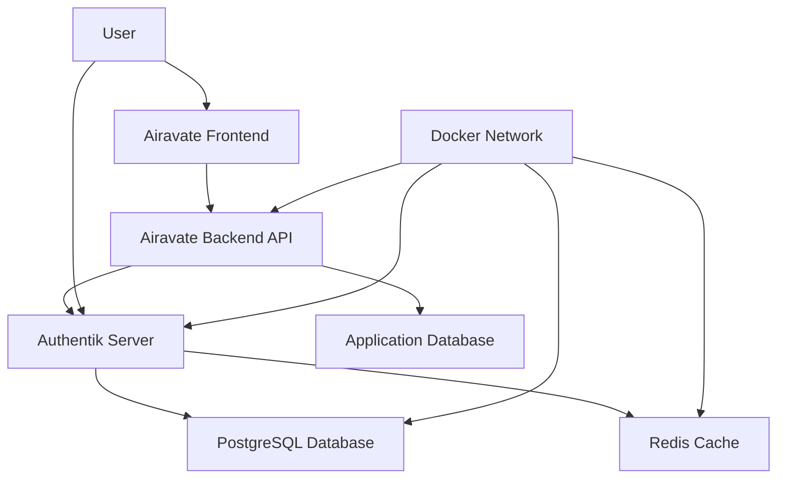

# 🔐 Authentik Self-Hosted Authentication Setup

Authentik is a self-hosted identity provider (IdP) that provides OAuth2/OpenID Connect authentication for the Airavate Backend API. This setup provides enterprise-grade authentication with full control over user data and authentication flows.

## 📋 **Quick Start**

### **1. Prerequisites**
- Docker and Docker Compose installed
- PostgreSQL 16+ (included in docker-compose)
- Redis (included in docker-compose)
- Minimum 2GB RAM for Authentik services

### **2. Initial Setup**
```bash
# Navigate to authentik directory
cd authentik

# Copy environment file and configure
cp .env.example .env
# Edit .env file with your configuration

# Start all services
docker-compose up -d

# Check service status
docker-compose ps
```

### **3. Access Authentik**
- **Admin Interface**: http://localhost:9000/if/admin/
- **Default Credentials**: 
  - Username: `akadmin`
  - Password: Check docker logs: `docker-compose logs server | grep "Generated password"`

## 🏗️ **Architecture Overview**



## 🔧 **Configuration Details**

### **Environment Variables (.env)**
```env
# PostgreSQL Configuration
PG_PASS=your_secure_database_password
PG_USER=authentik
PG_DB=authentik

# Authentik Core Configuration
AUTHENTIK_SECRET_KEY=your_64_character_random_secret_key_here
AUTHENTIK_ERROR_REPORTING=false

# Email Configuration (Production)
SMTP_HOST=smtp.your-provider.com
SMTP_PORT=587
SMTP_USERNAME=your_smtp_username
SMTP_PASSWORD=your_smtp_password
SMTP_USE_TLS=true
SMTP_FROM=noreply@yourdomain.com

# Port Configuration
COMPOSE_PORT_HTTP=9000
COMPOSE_PORT_HTTPS=9443
```

### **Required Setup Steps**

#### **1. Application Configuration**
1. Access Authentik admin interface
2. Navigate to **Applications** → **Applications**
3. Create new application:
   - **Name**: `Airavate Backend`
   - **Slug**: `airavate-backend`
   - **Provider**: Create new OAuth2/OpenID Provider

#### **2. OAuth2 Provider Setup**
1. Create OAuth2/OpenID Connect Provider:
   - **Name**: `Airavate Backend Provider`
   - **Authorization flow**: `authorization-code`
   - **Client type**: `Confidential`
   - **Client ID**: Generate or set custom value
   - **Client Secret**: Generate secure secret
   - **Redirect URIs**: 
     ```
     http://localhost:3000/api/v1/auth/callback
     https://yourdomain.com/api/v1/auth/callback
     ```
   - **Scopes**: `openid`, `profile`, `email`, `offline_access`

#### **3. Backend Integration**
Update your Airavate Backend `.env` file:
```env
AUTHENTIK_ISSUER=http://localhost:9000/application/o/airavate-backend/
AUTHENTIK_CLIENT_ID=your_client_id_from_authentik
AUTHENTIK_CLIENT_SECRET=your_client_secret_from_authentik
AUTHENTIK_REDIRECT_URI=http://localhost:3000/api/v1/auth/callback
AUTHENTIK_SCOPE=openid profile email offline_access
```

## 🚀 **Production Deployment**

### **Security Considerations**
- [ ] Change default admin password
- [ ] Generate strong `AUTHENTIK_SECRET_KEY` (64+ characters)
- [ ] Use strong database password
- [ ] Configure HTTPS with valid SSL certificates
- [ ] Set up proper firewall rules
- [ ] Enable audit logging
- [ ] Configure email for user notifications
- [ ] Set up regular database backups

### **SSL/HTTPS Configuration**
For production, place Authentik behind a reverse proxy (Nginx/Traefik):

```nginx
# Nginx configuration for Authentik
server {
    listen 443 ssl http2;
    server_name auth.yourdomain.com;

    ssl_certificate /path/to/ssl/certificate.crt;
    ssl_certificate_key /path/to/ssl/private.key;

    location / {
        proxy_pass http://127.0.0.1:9000;
        proxy_http_version 1.1;
        proxy_set_header Upgrade $http_upgrade;
        proxy_set_header Connection "upgrade";
        proxy_set_header Host $host;
        proxy_set_header X-Real-IP $remote_addr;
        proxy_set_header X-Forwarded-For $proxy_add_x_forwarded_for;
        proxy_set_header X-Forwarded-Proto $scheme;
    }
}
```

### **High Availability Setup**
For production environments, consider:
- Multiple Authentik server instances behind load balancer
- External PostgreSQL cluster (AWS RDS, Google Cloud SQL)
- Redis cluster for session management
- Regular database backups and disaster recovery plan

## 📊 **Monitoring & Maintenance**

### **Health Checks**
```bash
# Check all services status
docker-compose ps

# View logs
docker-compose logs server
docker-compose logs worker
docker-compose logs postgresql
docker-compose logs redis

# Check resource usage
docker stats
```

### **Database Maintenance**
```bash
# Backup database
docker-compose exec postgresql pg_dump -U authentik authentik > backup.sql

# View database stats
docker-compose exec postgresql psql -U authentik -c "SELECT version();"
```

### **Performance Monitoring**
- Monitor container resource usage
- Track authentication success/failure rates
- Monitor database connection pool usage
- Set up alerts for service failures

## 🔧 **Troubleshooting**

### **Common Issues**

#### **Service Won't Start**
```bash
# Check logs for errors
docker-compose logs server
docker-compose logs worker

# Verify environment variables
docker-compose config

# Restart services
docker-compose restart
```

#### **Database Connection Issues**
```bash
# Check PostgreSQL status
docker-compose exec postgresql pg_isready

# View database connections
docker-compose exec postgresql psql -U authentik -c "SELECT * FROM pg_stat_activity;"
```

#### **OAuth2 Configuration Issues**
1. Verify redirect URIs match exactly
2. Check client ID and secret in both Authentik and backend
3. Ensure issuer URL is accessible from backend
4. Verify scopes are correctly configured

### **Reset Admin Password**
```bash
# Access Authentik container
docker-compose exec server ak manage createsuperuser

# Or reset existing user
docker-compose exec server ak manage changepassword akadmin
```

## 📚 **Integration Examples**

### **Frontend Integration (React)**
```typescript
const initiateAuth = () => {
  window.location.href = 'http://localhost:3000/api/v1/auth/login';
};

const handleCallback = async (code: string, state: string) => {
  const response = await fetch(`/api/v1/auth/callback?code=${code}&state=${state}`);
  const result = await response.json();
  
  if (result.tokens) {
    localStorage.setItem('access_token', result.tokens.access_token);
    localStorage.setItem('refresh_token', result.tokens.refresh_token);
  }
};
```

### **API Usage**
```typescript
// Make authenticated requests
const apiCall = async () => {
  const token = localStorage.getItem('access_token');
  
  const response = await fetch('/api/v1/users/profile', {
    headers: {
      'Authorization': `Bearer ${token}`,
      'Content-Type': 'application/json'
    }
  });
  
  return response.json();
};
```

## 🔗 **Related Documentation**
- [Integration Guide](./INTEGRATION_GUIDE.md) - Complete backend integration steps
- [Setup Troubleshooting](./SETUP_TROUBLESHOOTING.md) - Common issues and solutions
- [Status Complete](./STATUS_COMPLETE.md) - Verification checklist
- [Official Authentik Documentation](https://docs.goauthentik.io/)
- [OAuth2/OpenID Connect Specification](https://openid.net/connect/)

## 🆘 **Support**
For Authentik-specific issues, consult:
- [Authentik Documentation](https://docs.goauthentik.io/)
- [Authentik Community Discord](https://discord.gg/jg33eMhnj6)
- [GitHub Issues](https://github.com/goauthentik/authentik/issues)

For Airavate Backend integration issues, refer to the main project documentation.
